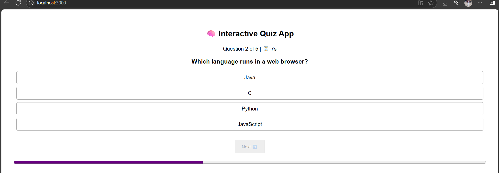

# QuizPlay_ReactApp 🎯

A fun and interactive frontend quiz app built with **React**. Users can play quizzes, get instant feedback, and see their scores!


## Inshort: 
QuizPlay - A Dynamic Quiz Application with Score Dashboard & Countdown Timer 

A responsive, frontend-based quiz platform featuring a countdown timer for each quiz session, real-time score tracking, and a clean summary dashboard.


## 🚀 Features
- Play quizzes with multiple-choice questions  
- Track score and progress  
- Responsive design  
- Built using React Hooks (`useState`, `useEffect`)

## 📦 Tech Stack
- React 19  
- React Scripts  
- JavaScript (ES6+)  
- CSS

## 🛠️ Getting Started

```bash
git clone https://github.com/ankit485803/QuizPlay_ReactApp.git
cd QuizPlay_ReactApp
npm install
npm start


## 🖼️ Dashboard Preview


<br><br>

<!--  This section for dashboard -->


